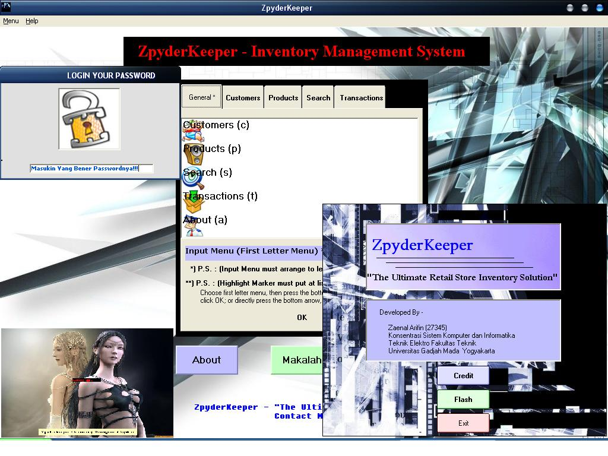



## ZpyderKeeper \- Store Keeper Management

### Description

For Store Keeper Management, such as saving the customers bio and products. And i included with a beautiful Login Session that can mask with sentences not Password Char (*), a web browser, and shockwave flash player. An interactive list menu eith pictures.
 
### More Info
 
input for customers member and kind of products that we sale

for the login sessions i create the password with name "admin" but in the password box, it is writes with word "masuk". coz i masking that with sentences. "Masukin Passwordnya yang Bener!!!".

Database about Customers and Products

there is no side effect

             |
---                |---
**Submitted On**   |2006-04-29 02:04:58
**By**             |[zaenal arifin](https://github.com/Planet-Source-Code/PSCIndex/blob/master/ByAuthor/zaenal-arifin.md)
**Level**          |Intermediate
**User Rating**    |4.7 (14 globes from 3 users)
**Compatibility**  |VB 6\.0
**Category**       |[Complete Applications](https://github.com/Planet-Source-Code/PSCIndex/blob/master/ByCategory/complete-applications__1-27.md)
**World**          |[Visual Basic](https://github.com/Planet-Source-Code/PSCIndex/blob/master/ByWorld/visual-basic.md)
**Archive File**   |[ZpyderKeep1990504292006\.zip](https://github.com/Planet-Source-Code/zaenal-arifin-zpyderkeeper-store-keeper-management__1-65138/archive/master.zip)

